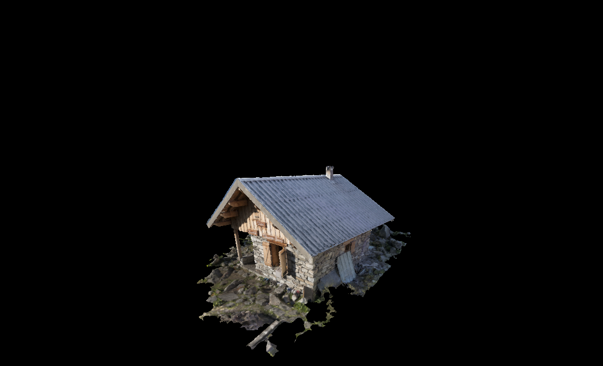

# Basic-vulkan

This is mainly done as a educational project to learn and understand more about vulkan api. Follows fairly closely https://vulkan-tutorial.com/.
Aim of this projects is to provide good template for other vulkan projects.
Uses [GLFW](https://www.glfw.org/) for crossplatform windows. Project can be build for Windows and Linux/Unix platform

# image

